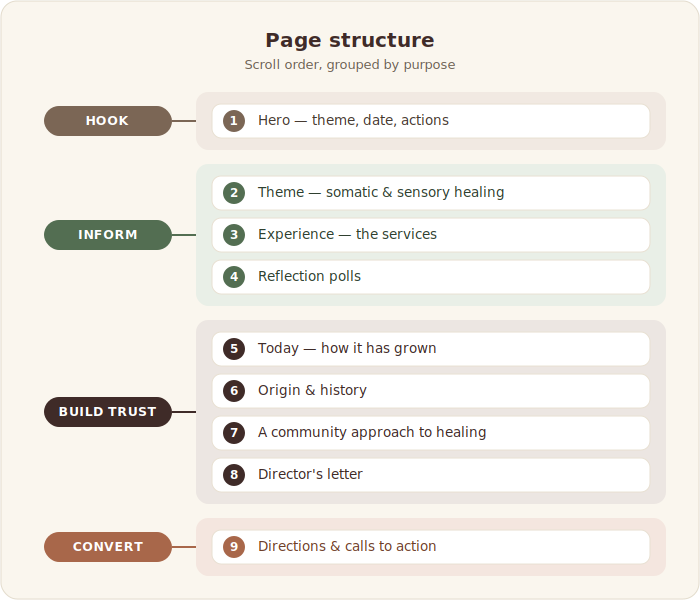
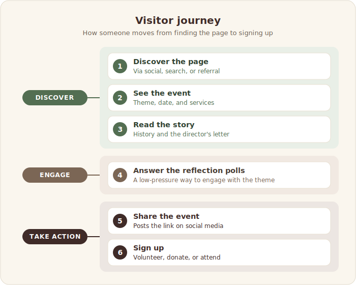

# Healing Clinic 2025: Sensory Somatics 

**Community Event Landing Page**

A centralized landing page for Youth Spirit Artworks' 4th Annual Healing Clinic,
a free day of holistic healing and community care for youth ages 14–25. The
website became the organization's first dedicated event page, giving youth,
volunteers, donors, community partners, and staff a single place to learn about
the event, register, and get involved.

## Purpose

Before this project, information about the Healing Clinic was spread across
flyers, social media posts, emails, registration forms, and other materials. I
designed the website to centralize everything in one place, making it easier for
people to learn about the event, answer common questions, and take action. I
also integrated Jotform registrations to centralize participant information and
simplify data collection for staff.

## Website Structure

**Event Overview**
Introduces the Healing Clinic, who it serves, and what participants can expect.

⬇

**About the Healing Clinic**
Explains the clinic's history, community-centered philosophy, available healing
modalities, and includes a letter from the Executive Director sharing the vision
behind the event.

⬇

**Interactive Reflection**
Reflection questions encourage visitors to engage with the content and connect
personally with the event before attending.

⬇

**Registration & Resources**
Visitors can register, volunteer, donate, access directions, and share the event
through clear calls to action and integrated Jotform registration forms.

## Impact

The website centralized everything people needed to learn about and participate
in the Healing Clinic. Instead of directing people to multiple flyers, emails,
social media posts, and registration links, the team could share one website
that answered common questions, streamlined registration and volunteer sign-ups,
and supported donations and community outreach.

---

**Role:** End-to-end design, information architecture, copywriting, and development

**Tool:** Canva Sites

**Live page:** https://ysadropin.my.canva.site/example
